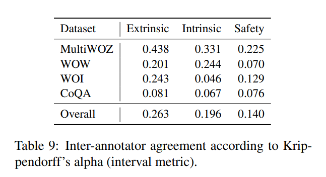

- n-gram Overlap Metrics for Content Selection
  - F-score. F-measure
  - Bleu. The Bilingual Evaluation Understudy
  - Rouge. Recall-Oriented Understudy for Gisting Evaluation
  - Meteor. The Metric for Evaluation of Translation with Explicit ORdering
  - Cider. Consensus-based Image Description Evaluation
  - Nist.
  - Gtm. The gtm metric
  - Hlepor. Harmonic mean of enhanced Length Penalty, Precision, n-gram Position difference Penalty, and Recall
  - Ribes. Rank-based Intuitive Bilingual Evaluation Score
  - dice and masi.
- Distance-Based Evaluation Metrics for Content Selection
  - Wer. Word error rate
  - Ter. Translation edit rate
- Vector Similarity-Based Evaluation Metrics
  - Meant 2.0
  - Yisi
  - Word Mover’s Distance
  - Sentence Mover’s Distance (smd)
- n-gram-Based Diversity Metrics
  - Type-Token Ratio (ttr)
  - Self-bleu
- Explicit Semantic Content Match Metrics
  - Pyramid
  - Spice. Semantic propositional image caption evaluation
  - Syntactic Similarity-Based Metrics
  - tesla (Dahlmeier et al., 2011)
- Machine-Learned Evaluation Metrics
  - Enhanced Sequential Inference Model (ESIM)
  - Ruse (Shimanaka et al. (2018)
- Evaluation Models with Human Judgments
  - Adem. Lowe et al. (2017)
  - Huse. Human Unified with Statistical Evaluation. Hashimoto et al. (2019)
  - Bertscore, (Zhang et al., 2020a).
  - Roberta-sts. Kan´e et al. (2019)
  - bleurt (Sellam et al., 2020)
  - comparator evaluator (Zhou & Xu, 2020)
  - Ranking Generated Summaries by Correctness: An Interesting but Challenging Application for Natural Language Inference
  - On Faithfulness and Factuality in Abstractive Summarization
  - Evaluating Semantic Accuracy of Data-to-Text Generation with Natural Language Inference
  - Evaluating Factuality in Generation with Dependency-level Entailment
  - Evaluating the Factual Consistency of Abstractive Text Summarization
  - Apes. Question Answering as an Automatic Evaluation Metric for News Article Summarization
  - Perception Score. Perception Score, A Learned Metric for Open-ended Text Generation Evaluation
- Composite Metric Scores
  - Learning-based Composite Metrics for Improved Caption Evaluation
  - Learning Compact Reward for Image Captioning

# Correlation

## Correlation

### Spearman

- эта корреляция говорит о монотонной зависимости 2 переменных. если одна увеличивается, другая тоже(или уменьшается). или одна уменьшается, другая увеличивается(или уменьшается).
- p-value означает вероятность того что заявленная корреляция будет такая же или больше
- https://youtu.be/JwNwbu-g2m0

### Pearson

- говорит от линейной зависимости 2 переменных

### [Spearman vs Pearson]

- [Clearly explained: Pearson V/S Spearman Correlation Coefficient](https://towardsdatascience.com/clearly-explained-pearson-v-s-spearman-correlation-coefficient-ada2f473b8)
- [Pearson correlation vs. Spearman correlation methods](https://www.surveymonkey.com/market-research/resources/pearson-correlation-vs-spearman-correlation/)

# n-gram Overlap Metrics for Content Selection

## F-score. F-measure

- Область применения: machine translation, summarization

## [Bleu. The Bilingual Evaluation Understudy](https://aclanthology.org/P02-1040.pdf) 

- Область применения: machine translation, summarization,
- Датасаты с корреляцией: ROCStories, Large Movie Review Conditional, COCO Image Captions, Large Movie Review Unconditional dataset

### Описание

BLEU (Bilingual Evaluation Understudy) - алгоритм который сравнивает совпадение оригинального текста и сгенерированного на соответствие по различным n gram. Изначально был разработан для machine translation.

### Принцип работы

- _R1_: The cat is on the mat.
- _R2_: There is a cat on the mat.
- _C1_: The cat and the dog.

BLEU считает количество слов в сгененированном предложении, которые встречаются во всех референсах, и делит это количество на длину слова. Авторы утверждают что 1-gram отвечают за _adequacy_, а более длинные n-grams за _fluency_.

#### Пример 1. $BLEU_1$

$BLEU_1(C1) = 3/5 = 0.6$

Слова the, cat, the. "The" присутствует в R1 и R2. "cat" присутствует в R1 и R2. слова "and" нет в референсах, не учитываем. "the" присутствует, считаем. "dog" - нет.

По итогу имеем 3/len(C1) = 3/5.

#### Пример 2. $BLEU_1$

С2 = The The The The The.

$BLEU_1(C2) = 5/5 = 1$

Слово "The" встречается 5 раз. Поэтому мы получили высокий результат для плохого перевода. Для этого воспользуемся слудующей формулой.

$Count_{clip} = min(Count,MaxRefCount)$

- Count - количество встречаемости слова (как в примере 1)
- MaxRefCount - максимальное количество таких слов в одном из референсов

Используя это ограничение, мы получаем следующее

$BLEU_1(C2) = 2/5 = 0.4$

Так как в "The cat is on the mat" слово the встречается 2 раза.

#### Пример 3. $BLEU_1$

- _R1_: The cat is on the mat.
- _R2_: There is a cat on the mat.
- _C3_: There is a cat on the mat.
- _C4_: Mat the cat is on a there.

$BLEU_1(C3) = 7/7 = 1$

$BLEU_1(C4) = 7/7 = 1$

Так как мы не учитываем порядок слов, то оба этих предложения получат максимальный скор.

Поэтому мы должны использовать n-gram. Для примера возьмем 2-gram

$BLEU_2(C3) = 6/6 = 1$

$BLEU_2(C4) = 0/6 = 0$

Ни одна биграмма не встречается в референсах в случае с предложением C4.

#### Пример 4. brevity penalty

- C5: of the
- R3: It is a guide to action that ensures that the military will forever heed Party commands.
- R4: It is the guiding principle which guarantees the military forces always being under the command of the Party.
- R5: It is the practical guide for the army always to heed the directions of the party.

"of the" встречается в двух примерах целиком, а это значит что BLUE =1

Чтобы решить эту проблему, авторы предлагают штрафовать предложения, которые короче чем самый ближайший референс.

$BP=e^{(1-r/c)}$

- r - длина референса (в токенах)
- с - длина сгенерированного перевода (в токенах)

$BLEU = BP * exp(\sum_{n=1}^Nw_n*logp_n)$

Авторы предлагают в основном использовать N=4, следовательно $w_n=1/N$.

### Ограничения

- ничего не знает об устройстве языка. все токены для него одинаковы.
- чем больше референсов используется, тем больший BLEU мы получаем. В оригинальном исследовании при использовании 4 референсов и 2, мы получаем 0.3468 и 0.2571 соответсвенно. Поэтому важно учитывать количество референсов при сравнении разных систем.

### Корреляция с человеческими оценками

- корреляция(pearson) с Monolingual Judgments составила 0.99 (оригинальная статья)
- корреляция(pearson) с Bilingual Judgments составила 0.96 (оригинальная статья)

#### [A Structured Review of the Validity of BLEU (30 August 2017)](https://aclanthology.org/J18-3002.pdf)

утверждает следующее: Корреляция BLEU с человеческими оценками очень зависит от деталей оцениваемых систем, точных используемых корпусных текстов и точного протокола, используемого для человеческих оценок. Если это так, то трудно предсказать, будет ли BLEU хорошо коррелировать с человеческими оценками в новом контексте. Даже в их исследовании корреляция сильно разнилась от работы к работе, а речь идет о machine translation

#### [How NOT To Evaluate Your Dialogue System: An Empirical Study of Unsupervised Evaluation (November 1-5, 2016)](https://aclanthology.org/D16-1230.pdf)

В данной работе рассматривается корреляция качества генерации диалога и метрик. Показано что на датасетах Twitter Corpus и Ubuntu Dialogue Corpus корреляция(Spearman, Pearson) с метрикой BLEU-4 составляет 0.3417, 0.1392 и 0.1218, 0.1132 соответсвенно. В общем очень низкая. Тогда как человеком который отмечал релевантность текста от 1 до 5 составила в среднем 0.95.

#### [Towards an Automatic Turing Test: Learning to Evaluate Dialogue Responses](https://aclanthology.org/P17-1103.pdf)

Использовался смешанный датасет Twitter Corpus и Ubuntu Dialogue Corpus, по итогу всего было размечено 4104 примеров. Cohen's kappa = 0.63

<details>
  <summary>Табличка с корреляцией</summary>
  
  
</details>

По итогу на их датасете корреляция (Spearman) с BLEU-4(pycocoevalcap)=0.051, c BLEU-2(pycocoevalcap)=0.039.

#### [GODEL: Large-Scale Pre-Training for Goal-Directed Dialog](https://arxiv.org/pdf/2206.11309.pdf)

На картинке ниже представленна inter-annotator agreement согласно Krippendorff’s alpha. Как мы можем заметить согласованность не превышает даже 0.5. Это свидетельствует о высоком уровне несогласованноти между разметчиками (кстати количество разметчиков не указывается в работе, что очень важно для подсчета данной формулы). Согласно книге [Klaus Krippendor Content Analysis An Introduction to Its Methodology](https://www.daneshnamehicsa.ir/userfiles/files/1/9-%20Content%20Analysis_%20An%20Introduction%20to%20Its%20Methodology.pdf), данные которые имеют уровень согласованности α < 0.667 не должны использованы в отчете, иными словами не являются валидными. Для справки 1 представляет полное согласие между оценщиками, 0 указывает на то, что они угадывают случайным образом, а -1 указывает на то, что оценщики систематически расходятся во мнениях. Подробнее с примерами можно [прочитать тут](https://www.surgehq.ai/blog/inter-rater-reliability-metrics-an-introduction-to-krippendorffs-alpha)

Соответственно насколько стоит верить корелляции с BLEU и другими метриками вопрос конечно открытый.

<details>
  <summary>Inter-annotator agreement согласно Krippendorff’s alpha.</summary>
  
  
</details>

Корреляция(spearman rank) с BLEU(из библиотеки evaluate). Более высокую корреляцию с Extrinsic авторы обосновывают более высоким уровнем согласия среди разметчиков.

| Dataset             | Extrinsic | Intrinsic | Safety |
| ------------------- | --------- | --------- | ------ |
| MultiWoz            | 0.217     | 0.142     | 0.132  |
| Wizard of Wikipedia | 0.072     | -0.022    | 0.020  |

#### [USR: An Unsupervised and Reference Free Evaluation Metric for Dialog Generation](https://arxiv.org/pdf/2005.00456.pdf)

<details>
  <summary>Inter-annotator agreement для Topical-Chat, PersonaChat.</summary>


</details>

<details>
  <summary>Turn-level корреляция для Topical-Chat</summary>


</details>

<details>
  <summary>Turn-level корреляция для PersonaChat</summary>


</details>

Корреляция с Overall Quality. Как видно в лучшем случае на Topical-Chat корреляция (Spearman) 0.2862 лучше всего с BLEU-2 . А на PersonaChat корреляция (Spearman) 0.1353 лучше всего с BLEU-4.

### Модификации

#### [sacreBLEU](https://github.com/mjpost/sacrebleu)

Так как токенизация сильно влияет на результат, то мы можем получать разные оценки в зависимости от токенизатора. Также в исходном BLEU присутсвует множество параметров, которые будут изменять конечный результат. sacreBLEU приходит на помощь и приводит в порядок данные недостатки.

### Пример использования

- данный пример показывает насколько все зависит от библиотеки, которую мы используем

```python
import numpy as np
import evaluate
from nltk.translate.bleu_score import sentence_bleu
from pycocoevalcap.bleu.bleu import Bleu

# returns geometric mean of n-gram precisions and brevity penalty
bleu = evaluate.load("bleu")
sacrebleu = evaluate.load("sacrebleu")
pycoco_bleu = Bleu(4)

references = [
    [
        "It is a guide to action that ensures that the military will forever heed Party commands.",
        "It is the guiding principle which guarantees the military forces always being under the command of the Party.",
        "It is the practical guide for the army always to heed the directions of the party."
    ],
]

candidates = [
    "It is a guide to action which ensures that the military always obeys the commands of the party.",
    "It is to insure the troops forever hearing the activity guidebook that party direct."
]
print("bleu")
for candidate in candidates:
    bleu_score = bleu.compute(
        predictions=[candidate],
        references=references
    )
    print(bleu_score['bleu'])

print("sacrebleu")
for candidate in candidates:
    bleu_score = sacrebleu.compute(
        predictions=[candidate],
        references=references
    )
    print(bleu_score['score'])

print("nltk bleu")
for candidate in candidates:
    candidate = candidate.split()
    reference = [item.split() for item in references[0]]
    bleu_score = sentence_bleu(reference, candidate)
    print(bleu_score)


print("pycoco_bleu")
# использовалась в этой работе https://github.com/PaddlePaddle/Research/tree/master/NLP/Dialogue-PLATO
# сравнение с прошлыми совсем некорректно, потому что неправильно просто усреднять
# по все получившимся метрикам. приведено в качестве примера.
for candidate in candidates:
    score, scores = pycoco_bleu.compute_score(
        {0: references[0]},
        {0: [candidate]}
    )
    result = np.mean(score)
    print(result)
# bleu
# 0.5401725898595141
# 0.0
# sacrebleu
# 54.017258985951415
# 6.699559159060897
# nltk bleu
# 0.4969770530031034
# 5.7264676266231995e-155
# pycoco_bleu
# 0.6801388372218287
# 0.15086224370747625
```

### Ссылки

- https://huggingface.co/spaces/evaluate-metric/bleu
- https://medium.com/nlplanet/two-minutes-nlp-learn-the-bleu-metric-by-examples-df015ca73a86
- https://aclanthology.org/P02-1040.pdf
- https://pypi.org/project/sacrebleu/2.3.1/
- https://machinelearningmastery.com/calculate-bleu-score-for-text-python/

## [Rouge. Recall-Oriented Understudy for Gisting Evaluation (2004)](https://aclanthology.org/W04-1013.pdf)

- Область применения: machine translation, image captioning, question generation, text summarization
- Подвиды:
  - ROUGE-N - считает совпавшие N-gram,
  - ROUGE-L - находит наибольшие совпашие общие места, пропуская слова,
  - ROUGE-W - задает вес расстаяниям между совпашими местами,
  - ROUGE-S\* - нечетко матчит совпавшие места, пропуская слова чтобы найти совпадение

### Описание

ROUGE (Recall-Oriented Understudy for Gisting Evaluation) - алгоритм который сравнивает совпадение оригинального текста и сгенерированного на соответствие по различным n gram. Изначально был разработан для text summarization.

### Принцип работы

Для того чтобы посчитать ROUGE нам нужно вычислить precision, recall, и F1-score по соответствующим n-gram.

- precision - это отношение количества совпавших n-gram из РЕФЕРЕНСА, к общему количеству n-gram в СГЕНЕРИРОВАННОМ предложении
- recall - это отношение количества совпавших n-gram из СГЕНЕРИРОВАННОГО предложения, к общему количеству n-gram в РЕФЕРЕНСЕ
- F1-score - это результат такой формулы $$F1score = 2 * (precision * recall) / (precision + recall)$$

#### Пример 1. $ROUGE_1$

- R: The cat is on the mat.
- C: The cat and the dog.

Из референса совпадает только 3 слова с сгенеренным предложением.

ROUGE-1 precision = 3 / len(C) = 3 / 5 = 0.6

В сгенеренном предложении только 3 слова совпадают с референсом.

ROUGE-1 recall = 3 / len(R) = 3 / 6 = 0.5

ROUGE-1 $F1score = 2 * (precision * recall) / (precision + recall) = 0.36$

#### Пример 2. $ROUGE_2$

- R: The cat is on the mat.
- C: The cat and the dog.

Только "The cat" из референса совпадает со сгенеренным предложением.

ROUGE-2 precision = 1/4 = 0.25

ROUGE-2 recall = 1/5 = 0.20

ROUGE-2 $F1score = 2 * (precision * recall) / (precision + recall) = 0.22$

#### Пример 3. ROUGE-L

ROUGE-L - использует принцип [самой длинной общей подпоследовательности](https://en.wikipedia.org/wiki/Longest_common_subsequence), при этом не обязательно чтобы общие слова шли друг за другом, важно лишь чтобы соблюдался их порядок.

- R: The gray and black cat is on the mat.
- C: The cat and the dog.
- len(X) - это функция которая возвращает количество слов

Так как нам не важно друг за другом идут слова или нет. Мы можем вытянуть последовательность "The cat the" из референса, игнорируя "gray and black".

ROUGE-L precision = 3/len(C) = 3 / 5 = 0.6

ROUGE-L recall = 3/len(R) = 3 / 9 = 0.333

ROUGE-L $F1score = 2 * (precision * recall) / (precision + recall) = 0.4285$

#### Пример 4. ROUGE-S

ROUGE-S это частный случай ROUGE-L. В ROUGE-S мы можем определять степень свободы поиска общих слов.

- R: The gray cat is on the mat.
- C: The cat and the dog.
- len(X) - это функция которая возвращает количество слов

В данном примере мы выставим параметр равным 2, тогда ROUGE-S2 проигнорирует "gray" и сматчит "the cat". Тогда как $ROUGE_2$ вовсе проигнорировала бы эту последовательность.
ROUGE-S precision = 1/len(C) = 1 / 5 = 0.2

ROUGE-S recall = 1/len(R) = 1 / 7 = 0.14

ROUGE-S $F1score = 2 * (precision * recall) / (precision + recall) = 0.1666$

#### Пример 5. ROUGE-W: Weighted Longest Common Subsequence

У ROUGE-L существует проблема, она не учитывает насколько далеко расположены общие слова.

- X: [**A B C D** E F G]
- Y1: [**A B C D** H I K]
- Y2: [**A** H **B** K **C** I **D**]

Y1 справляется с саммаризацией лучше чем Y2, потому что в Y1 последовательно совпадают примеры. Для ROUGE-L данные примеры были бы одинаковыми. Для этого был разработан _специальный_(подробное описание в статье) алгоритм, который учитывает расстояние между совпашими токенами.

Если опустить подробности, то подсчет представляет тот же самый F1-score

#### Пример 6. ROUGE-SU: Extension of ROUGE-S

Предположим у нас есть такой пример

- S5. gunman the killed police

Это просто предложение наоборот

- police killed the gunman

Просто ROUGE-S дало бы оценку 0 данному предложению, хотя в целом понятно, что по контенту это лучший результат. Поэтому помимо n-gram они предлагают также подсчитывать 1-gram, чтобы учесть совпадение единичных слов.

### Ограничения

- ничего не знает об устройстве языка. все токены для него одинаковы. поэтому если даже слова идентичны по смыслу, но не совпадают мы получим более низкий скор.

### Корреляция с человеческими оценками

Авторы статьи использовали 3 датасета: DUC 2001, 2002, и 2003

- DUC 2001 - 149 документов, саммари по 100 слов
- DUC 2002 - 295 документов, саммари по 100 слов
- DUC 2003 - 624 документов, саммари по 10 слов (типа хедлайнеров, ключевых слов и фраз)

- Лучшая метрика на датасете DUC 2001, 2002 - R-SU9, R-W-1.2 (разница в Pearson’s корреляции сотые доли)
- Лучшая метрика на датасете DUC 2003 - **R-L**, R-SU4, R-W-1.2 (разница в Pearson’s корреляции сотые доли)

#### [How NOT To Evaluate Your Dialogue System: An Empirical Study of Unsupervised Evaluation (November 1-5, 2016)](https://aclanthology.org/D16-1230.pdf)

В данной работе рассматривается корреляция качества генерации диалога и метрик. Показано что на датасетах Twitter Corpus и Ubuntu Dialogue Corpus корреляция(Spearman, Pearson) с метрикой ROUGE-L составляет 0.1235, 0.09714 и 0.05405, 0.06401 соответственно. В общем очень низкая. Тогда как человеком который отмечал релевантность текста от 1 до 5 составила около 0.95.

#### [Towards an Automatic Turing Test: Learning to Evaluate Dialogue Responses](https://aclanthology.org/P17-1103.pdf)

Использовался смешанный датасет Twitter Corpus и Ubuntu Dialogue Corpus, по итогу всего было размечено 4104 примеров. Cohen's kappa = 0.63

<details>
  <summary>Табличка с корреляцией</summary>
  
  
</details>

По итогу на их датасете корреляция (Spearman) с ROUGE(pycocoevalcap)=0.062.

#### [USR: An Unsupervised and Reference Free Evaluation Metric for Dialog Generation](https://arxiv.org/pdf/2005.00456.pdf)

<details>
  <summary>Inter-annotator agreement для Topical-Chat, PersonaChat.</summary>


</details>

<details>
  <summary>Turn-level корреляция для Topical-Chat</summary>


</details>

<details>
  <summary>Turn-level корреляция для PersonaChat</summary>


</details>

Корреляция с Overall Quality. На Topical-Chat корреляция (Spearman) с ROUGE-L=0.2745. На PersonaChat корреляция (Spearman) с ROUGE-L=0.0659.

### Пример использования

```python
# данная библиотека является оберткой над оригинальной имплементацией авторов
# https://github.com/li-plus/rouge-metric
from rouge_metric import PerlRouge

rouge = PerlRouge(
    rouge_n_max=3,
    rouge_l=True,
    rouge_w=True,
    rouge_w_weight=1.2,
    rouge_s=True,
    rouge_su=True,
    skip_gap=4
)

# Load summary results and evaluate
hypotheses = [
    'how are you\ni am fine',                       # document 1: hypothesis
    'it is fine today\nwe won the football game',   # document 2: hypothesis
]
references = [
    [
        'how do you do\nfine thanks',   # document 1: reference 1
    ],
    [
        'it is sunny today\nlet us go for a walk',  # document 2: reference 1
    ]
]

scores = rouge.evaluate(hypotheses, references)
for key in scores.keys():
    f1_score = scores[key]['f']
    print(f"{key} = {f1_score}")
# так как мы имеем дело с короткими текстами, то следует доверять больше метрике rouge-l
# rouge-1 = 0.53622
# rouge-2 = 0.20346
# rouge-3 = 0.11765
# rouge-l = 0.53622
# rouge-w-1.2 = 0.39308
# rouge-s4 = 0.272
# rouge-su4 = 0.33382

# his implementation is independant from the "official" ROUGE script
# https://github.com/pltrdy/rouge
from rouge import Rouge

reference2 = [ item[0] for item in  references ]

rouge = Rouge()
scores = rouge.get_scores(hypotheses, reference2, avg=True)
for key in scores.keys():
    f1_score = scores[key]['f']
    print(f"{key} = {f1_score}")
# Как можно заметить данные метрики отличаются от официальной обертки, с одинаковыми входными данными
# rouge-1 = 0.4306220045969644
# rouge-2 = 0.05882352692041533
# rouge-l = 0.4306220045969644

# https://torchmetrics.readthedocs.io/en/stable/text/rouge_score.html
from torchmetrics.text.rouge import ROUGEScore

rouge = ROUGEScore(accumulate='avg')

scores = rouge(hypotheses, reference2, )
for key in scores.keys():
    if "fmeasure" in key:
        f1_score = scores[key]
        print(f"{key} = {f1_score}")
# снова видим совпадение в некоторых местах, а где-то различие
# rouge1_fmeasure = 0.40789473056793213
# rouge2_fmeasure = 0.05882352963089943
# rougeL_fmeasure = 0.40789473056793213
# rougeLsum_fmeasure = 0.40789473056793213

# https://huggingface.co/spaces/evaluate-metric/rouge
import evaluate
rouge = evaluate.load('rouge')
results = rouge.compute(
    predictions=hypotheses,
    references=references
)
for key in results.keys():
    f1_score = results[key]
    print(f"{key} = {f1_score}")
# видим почти идеальное совпадение с предыдущим, только только потому что torchmetrics почти полностью скопировал код отсюда
# https://github.com/google-research/google-research/tree/master/rouge
# rouge1 = 0.40789473684210525
# rouge2 = 0.058823529411764705
# rougeL = 0.40789473684210525
# rougeLsum = 0.40789473684210525
```

### Ссылки

- https://aclanthology.org/W04-1013.pdf
- https://towardsdatascience.com/the-ultimate-performance-metric-in-nlp-111df6c64460
- https://medium.com/nlplanet/two-minutes-nlp-learn-the-rouge-metric-by-examples-f179cc285499

## [Meteor: An Automatic Metric for MT Evaluation with High Levels of Correlation with Human Judgments (2007)](https://www.cs.cmu.edu/~alavie/METEOR/pdf/Lavie-Agarwal-2007-METEOR.pdf)

- Область применения: machine translation

### Описание

### Принцип работы

- в BLEU подсчет n-gram служит как показатель корректности предложения с точки зрения грамматики. В Meteor авторы считаю что порядок слов важнее чем совпадение n-gram.
- в BLEU основной упор делается на presicion, данная метрика также внедряет recall

В METEOR мы имеем _специальный_ алгоритм word-matching, который подсчитывает совпадения uni-gram между переводом, который сгенерировала машина и референсом для этого перевода.

Визуально это выглядит вот так


#### Подсчет обычных совпадений слов (без использования стемминга или синонимов)

```python
# https://github.com/nltk/nltk/blob/a915791ad501d41dbb7e3c13c4877a734505eaab/nltk/translate/meteor_score.py#L78
"""
enum_hypothesis_list = [(0, 'it'), (1, 'is'), (2, 'a'), (3, 'guide'), (4, 'to'), (5, 'action'), (6, 'which'), (7, 'ensures'), (8, 'that'), (9, 'the'), (10, 'military'), (11, 'always'), (12, 'obeys'), (13, 'the'), ...]

enum_reference_list = [(0, 'it'), (1, 'is'), (2, 'a'), (3, 'guide'), (4, 'to'), (5, 'action'), (6, 'that'), (7, 'ensures'), (8, 'that'), (9, 'the'), (10, 'military'), (11, 'will'), (12, 'forever'), (13, 'heed'), ...]
"""

word_match = []
for i in range(len(enum_hypothesis_list))[::-1]:
    for j in range(len(enum_reference_list))[::-1]:
        if enum_hypothesis_list[i][1] == enum_reference_list[j][1]:
            word_match.append(
                (enum_hypothesis_list[i][0], enum_reference_list[j][0])
            )
            enum_hypothesis_list.pop(i)
            enum_reference_list.pop(j)
            break
return word_match, enum_hypothesis_list, enum_reference_list
```

#### Подсчет чанков для референса и гипотезы

```python
"""
Counts the fewest possible number of chunks such that matched unigrams
of each chunk are adjacent to each other.
matches = [
  (0, 0), (1, 1), (2, 2), (3, 3), (4, 4), (5, 5), (7, 7), (8, 8), (10, 10),
  (14, 15),
  (16, 9),
  (17, 14)
]
"""
i = 0
chunks = 1
while i < len(matches) - 1:
    if (matches[i + 1][0] == matches[i][0] + 1) and (
        matches[i + 1][1] == matches[i][1] + 1
    ):
        i += 1
        continue
    i += 1
    chunks += 1
return chunks
# chunks=6
```

#### Формула вычисления meteor

```python
# https://github.com/nltk/nltk/blob/a915791ad501d41dbb7e3c13c4877a734505eaab/nltk/translate/meteor_score.py#L260
precision = matches_count / translation_length
recall = matches_count / reference_length
fmean = (precision * recall) / (alpha * precision + (1 - alpha) * recall)

frag_frac = chunk_count / matches_count
penalty = gamma * frag_frac**beta
# итоговый скор
METEOR_2005 =  (1 - penalty) * fmean
# METEOR 2004 has α = 0.9, β = 3.0 and γ = 0.5
# METEOR 2005 has α = 0.9, β = 3.0 and γ = 0.5 (для конкретного языка данные параметры варьируются, подробнее в статье)
```

### Корреляция с человеческими оценками ([meteor_2004](https://aclanthology.org/W05-0909.pdf) )

Для оценки корреляции авторы использовали датасет:

- DARPA/TIDES 2003 Arabic-to-English and Chinese-to-English

**Arabic-to-English** - 664 sentences.
**Chinese-to-English** - 920 sentences.

У каждого предложения имеется по 4 референса. Каждая оценка перевода производилась 2 судьями по 2 Adequacy and a Fluency Score. В этой работе, авторы усредняли предыдущие 2 метрики, назвали его Combined Score.

На датасете Chinese-to-English TIDES 2003 корреляция (Pearson) с METEOR=0.964, BLEU=0.817, NIST=0.892. Данная корреляция является **system level**. system level означает, что они взяли все оценки предложений, которые предоставила система перевода и взяли все оценки которые сделали люди для этой системы, потом усреднили оценки для автоматических метрик и для оценок пользователей. На основе этого они провели анализ корреляции.

Также был проведен анализ корреляции(Pearson) между **индивидуальными** оценками METEOR и человеческими оценками одних и тех же предложений. По итогу в среднем для **Arabic Dataset** они получили **0.347**, а для **Chinese Dataset** **0.331**. Авторы также отмечают что в данных датасетах в некоторых местах низкий уровень согласия между людьми. В результате _нормализации_ этих оценок, корреляция стала **0.403** и **0.365**.

#### [How NOT To Evaluate Your Dialogue System: An Empirical Study of Unsupervised Evaluation (November 1-5, 2016)](https://aclanthology.org/D16-1230.pdf)

В данной работе рассматривается корреляция качества генерации диалога и метрик. Показано что на датасетах Twitter Corpus и Ubuntu Dialogue Corpus корреляция(Spearman, Pearson) с метрикой METEOR(2005) составляет 0.1887, 0.1927 и 0.06314, 0.1419 соответственно. В общем очень низкая. Тогда как человеком который отмечал релевантность текста от 1 до 5 составила около 0.95.

#### [Towards an Automatic Turing Test: Learning to Evaluate Dialogue Responses](https://aclanthology.org/P17-1103.pdf)

Использовался смешанный датасет Twitter Corpus и Ubuntu Dialogue Corpus, по итогу всего было размечено 4104 примеров. Cohen's kappa = 0.63

<details>
  <summary>Табличка с корреляцией</summary>
  
  
</details>

По итогу на их датасете корреляция (Spearman) с METEOR(pycocoevalcap)=0.021.

#### [USR: An Unsupervised and Reference Free Evaluation Metric for Dialog Generation](https://arxiv.org/pdf/2005.00456.pdf)

<details>
  <summary>Inter-annotator agreement для Topical-Chat, PersonaChat.</summary>


</details>

<details>
  <summary>Turn-level корреляция для Topical-Chat</summary>


</details>

<details>
  <summary>Turn-level корреляция для PersonaChat</summary>


</details>

Корреляция с Overall Quality. На Topical-Chat корреляция (Spearman) с METEOR=0.3365. На PersonaChat корреляция (Spearman) с METEOR=0.2527.

### Пример использования

```python
# https://huggingface.co/spaces/evaluate-metric/meteor
import evaluate

meteor = evaluate.load('meteor')
predictions = ["It is a guide to action which ensures that the military always obeys the commands of the party"]
references = ["It is a guide to action that ensures that the military will forever heed Party commands"]

results = meteor.compute(
    predictions=predictions,
    references=references
)
results
# результат совпадает с NLTK, потому что эта либа и есть обертка над NLTK.
print(results['meteor'])
# 0.6944444444444445

from nltk.translate.meteor_score import meteor_score

hypothesis1 = "It is a guide to action which ensures that the military always obeys the commands of the party".split()
reference1 = "It is a guide to action that ensures that the military will forever heed Party commands".split()

print(
  meteor_score(
    [reference1],
    hypothesis1
    ),
)
# 0.6944

print(
  meteor_score([
    ['this', 'is', 'a', 'cat']],
    ['non', 'matching', 'hypothesis']),
)
# 0.0
```

#### [Официальная имплементация meteor(2005)](https://www.cs.cmu.edu/~alavie/METEOR/index.html#Download)

**Переходим в папку [metrics/meteor/meteor-1.0/meteor-compiled-1.0](metrics/meteor/meteor-1.0/meteor-compiled-1.0)**

```xml
<!-- my-ref.sgm-->
<!-- это файл с референсами -->
<refset trglang="en" setid="newstest2009" srclang="any">
<doc sysid="ref" docid="ihned.cz/2008/09/30/36776" genre="news" origlang="cz">
<hl>
<seg id="1"> It is a guide to action that ensures that the military will forever heed Party commands </seg>
</hl>
</doc>
</refset>
```

```xml
<!-- my-test.sgm -->
<!-- файл со сгенеренными переводами -->

<tstset trglang="en" setid="newstest2009" srclang="any">
<doc sysid="cmu-combo" docid="ihned.cz/2008/09/30/36776" genre="news" origlang="cz">
<hl>
<seg id="1"> It is a guide to action which ensures that the military always obeys the commands of the party </seg>
</hl>
</doc>
</tstset>
```

```bash
java -jar meteor.jar example/my-test.sgm example/my-ref.sgm -sgml -p "0.9 3.0 0.5"
```

```console
Test words:             18
Reference words:        16
Chunks:                 5
Precision:              0.7222222222222222
Recall:                 0.8125
f1:                     0.7647058823529411
fMean:                  0.8024691358024691
Fragmentation penalty:  0.02844788347746928

Final score:            0.779640587332895
```

**И снова результат отличается от другой реализации**

Понятно что данные и скрипты которые вычисляли корреляцию авторы тоже не положили.

#### [Официальная имплементация meteor(2014)](http://www.cs.cmu.edu/~alavie/METEOR/index.html#Download)

- файлы перевода и референсов остались неизменными
- данная реализация сильно отличается от версии 1.0, поэтому их даже сравнивать некорректно

**переходим в папку [metrics/meteor/meteor-1.5](metrics/meteor/meteor-1.5)**

```bash
java -Xmx2G -jar  meteor-1.5.jar example/my-test.sgm example/my-ref.sgm -sgml  -p "0.9 3.0 0.5 0.7"
```

```console
Meteor version: 1.5

Eval ID:        meteor-1.5-wo-en-no_norm-0.9_3.0_0.5_0.7-ex_st_sy_pa-1.0_1.0_0.6_0.8

Language:       English
Format:         SGML
Task:           Custom
Modules:        exact stem synonym paraphrase
Weights:        1.0 1.0 0.6 0.8
Parameters:     0.9 3.0 0.5 0.7

[newstest2009][cmu-combo]

           Test Matches                  Reference Matches
Stage      Content  Function    Total    Content  Function    Total
1                4         6       10          4         6       10
2                0         0        0          0         0        0
3                0         0        0          0         0        0
4                2         1        3          2         2        4
Total            6         7       13          6         8       14

Test words:             18
Reference words:        16
Chunks:                 2
Precision:              0.6930232558139536
Recall:                 0.7750000000000001
f1:                     0.731722772277228
fMean:                  0.7659398059862368
Fragmentation penalty:  0.0016257684296093072

Final score:            0.7646945652306834
```

## Cider. Consensus-based Image Description Evaluation

- Область применения:  image captioning

## Nist.

- Область применения:  machine translation

## Gtm. The gtm metric 

- Область применения:  machine translation

## Hlepor. Harmonic mean of enhanced Length Penalty, Precision, n-gram Position difference Penalty, and Recall 

- Область применения:  machine translation

## Ribes. Rank-based Intuitive Bilingual Evaluation Score

- Область применения:  machine translation

## dice and masi.

- Область применения: генерация описания по картинке с референсом

# Distance-Based Evaluation Metrics for Content Selection

## Wer. Word error rate 

- Область применения: speech recognition systems,
- Ограничения: имеет нижнюю оценку в виде 0 (значит что пример идеален), но не имеет верхнюю оценку что делает трудным оценку

## Ter. Translation edit rate 

- Область применения:  machine translation

# Vector Similarity-Based Evaluation Metrics

## Meant 2.0

- Область применения:  machine translation

## Yisi

- Область применения:  machine translation

## Word Mover’s Distance

- Область применения:  sentence-level task - image caption generation

## Sentence Mover’s Distance (smd)

- Область применения:  оценка документов?

# n-gram-Based Diversity Metrics

## Type-Token Ratio (ttr)

- Область применения:  оценка разнообразности речи

## Self-bleu

- Область применения: оценка разнообразности речи

# Explicit Semantic Content Match Metrics

## Pyramid

- Область применения: document summarization,
- Модификации: PEAK - Pyramid Evaluation via Automated Knowledge Extraction

## Spice. Semantic propositional image caption evaluation

- Область применения:  image captioning

##  Syntactic Similarity-Based Metrics

## tesla (Dahlmeier et al., 2011)

- Область применения:  machine translation, story generation, question generation,  abstractive text summarization

# Machine-Learned Evaluation Metrics

## [FineD-Eval: Fine-grained Automatic Dialogue-Level Evaluation (29 Oct 2022)](https://arxiv.org/pdf/2210.13832v2.pdf)

- Область применения: dialogue-Level evaluation

### Описание

Метрика для оценки диалога на turn level. Данная метрика оценивает реплику по 3 направлениям: coherence, likability, and topic
depth.

### Принцип работы

Сначала они взяли датасет FED и проанализировали его на Spearman корреляцию по всем 11 направлениям (Coherence, Understanding, Likability, Flexibility, Informativeness, Topic Depth, Diversity, Informativeness, Consistency, Inquisitiveness, Error Recovery). Потом сгруппировали коррелирующие между собой направления на Coh, Lik, Top, Con, Inq, Err. И затем выбрали наиболее менее коррелирующие между собой: coherence, likability, and topic depth. Они выбрали данные направления, также потому что чаще всего исследователи хотят построить в своих работах чат ботов, которые отвечают с вовлеченностью, с использованием предыдущих знаний и связно.

#### Детали реализации

- предварительно данные были отфильтрованы по критерию low inter-annotator agreement (< 0.6)

Задача работы была такая чтобы построить функцию, которая бы выдавала оценки по 3 группам, и нам бы хотелось чтобы данные оценки от модели хорошо коррелировали с теми же оценками от пользователей.

Было предложено 2 способа решения этой задачи: multitask learning и ensemble отдельных моделей.

- multitask learning мы одновременно учим по 3 направлениям
- ensemble мы усредняем все 3 отдельные метрики

Для каждой метрики были выбраны положительные и отрицательные примеры. Модель училась предсказывать более высокий скор для положительного примера. Для этого использовался [MarginRankingLoss](https://pytorch.org/docs/stable/generated/torch.nn.MarginRankingLoss.html) $loss(x_1,x_2,y)=max(0,−y*(x1−x2)+margin)$.

Данный лосс подразумевает что если мы передали в качестве таргета 1, то мы ожидаем что $x_1$ будет оценен выше, а если -1, то $x_2$ будет оценен выше. $x_1$ и $x_2$ это [усреднения векторов](https://github.com/e0397123/FineD-Eval/blob/759f638bab16df29e88ac0288c3697976531792a/src/models/fined.py#L54), которые мы получаем с модели roberta-base.

#### Особенности семплирования

Для разных направлений были применены различные способы семплирования.

**Coherence (Coh)**

В качестве позитивных примеров были выбраны диалоги из корпуса как они есть, чтобы сгенерировать отрицательные примеры пары диалоги они просто изменяли порядок из положительных. Также для отбора использовалась метрика question-answer (QA) relevance scoring, данный скор измерялся при помощи заранее натренированной модели [iarfmoose/bert-base-cased-qa-evaluator](https://huggingface.co/iarfmoose/bert-base-cased-qa-evaluator) - данная модель принимает на вход вопрос и ответ, на выходе мы получаем число от 0 до 1, которое обозначает вероятность того что данная пара корректна.

На основе этого было задано два thresholds(подбирались эвристически), на основе которых формировались отрицательные примеры и положительные.

**Likability (Lik)**

Позитивные примеры выбирались на основе значений CONTRADICTION (от 0 до 1), которые выдавала модель [roberta-large-mnli](https://huggingface.co/roberta-large-mnli). Соответственно имея $n$ реплик диалога, мы можем получить $n-1$ пар для анализа моделью. Эмпирически было выбрано 2 theshholds, на основе которых примеры отсекались или добавлялись в выборку.

Также для отбора учитывался уровень позитивных диалогов(данный уровень оценивался данной моделью [t5-base-finetuned-emotion](https://huggingface.co/mrm8488/t5-base-finetuned-emotion)), диалоги где было больше чем 2 позитивных реплики заносились в выборку как положительные примеры, иначе отрицательные.

**Topic Depth (Top)**

Для оценки глубины тем в ходе диалога они использовали [roberta-large-mnli](https://huggingface.co/roberta-large-mnli). При помощи этой модели они также оценивали каждую пару диалога на основе ENTAILMENT (от 0 до 1). Потом они усредняли ENTAILMENT по всему диалогу и если в результате скор был ниже заранее заданного порога, то этот диалог брался как положительный пример, и наоборот.

#### Датасеты

Для тренировки и авторазметки было выбрано 2 диалоговых датасета:

- DailyDialog (DD)
- ConvAI2 (CA) PersonaChat.

Для итоговой оценки использовались 3 датасета с оценками:

- FED (Mehri and Eskenazi, 2020a),
- DSTC9-Interactive (Gunasekara et al., 2020),
- Persona-Eval (See et al., 2019).

У каждого из этих 3 датасетов, оценки выставлены для всего диалога, а не для отдельных реплик.

#### Бейзлайны

- USL-H (Phy et al., 2020)
- MAUDE (Sinha et al., 2020),
- MDD-Eval (Zhang et al., 2021b)
- Dscore (Zhang et al., 2021c).

Чтобы получить оценку всего диалога при помощи метрик которые оценивают только отдельные реплики, они просто усредняли значения по каждому из измерений на протяжении всего диалога.

### Анализ

#### dialogue-level метрики лучше чем turn-level метрики для оценки multi-turn диалогов?

Ответ: **Да**. Все предшевствующие turn-level метрики коррелируют хуже с человеческими оценками чем dialogue-level. Но их метрика самая лучшая(ну естественно).

### Ограничения

### Корреляция с человеческими оценками

- для датасета **FED** лучшая метрика $FineD-Eval_{mu}$. корреляция в среднем по всем 8 направлениям 61.84.
- для датасета **DSTC9-Interactive** лучшая метрика $FineD-Eval_{en}$. корреляция в среднем по всем 8 направлениям 19.73, но у $FineD-Eval_{mu}$ 19.60, что не такая большая разница.
- для датасета **Persona-Eval** лучшая метрика оказалась **Coherence (Coh)**. корреляция в среднем по всем 7 направлениям 22.32.

### Пример использования

```python
# исходный код слишком ужасен
# необходима полная переработка для широкого использования
```

### Ссылки

- https://github.com/e0397123/FineD-Eval

## Enhanced Sequential Inference Model (ESIM)

- Область применения:  machine translation
- Краткое описание: Измеряет похожесть референсов и сгенерированных примеров

## Ruse (Shimanaka et al. (2018)

Область применения:  machine translation

# Evaluation Models with Human Judgments

## Adem.  Lowe et al. (2017)

- Область применения: chat-bots

## Huse. Human Unified with Statistical Evaluation. Hashimoto et al. (2019)

- Область применения:  dialog and story generation

## Bertscore, (Zhang et al., 2020a).

- Область применения:  semantic evaluation
- Датасаты с корреляцией: ROCStories, Large Movie Review Conditional, COCO Image Captions, Large Movie Review Unconditional dataset

### Пример использования

```python
!pip install bert_score
bertscore_metric = load_metric('bertscore')

bert_scores = bertscore_metric.compute(predictions=[candidate], references=[ground1], lang="en")
print(bert_scores)
# Normally, we use the f1-score attribute
print(bert_scores['f1'])
```

## Roberta-sts. Kan´e et al. (2019) 

- Область применения:  semantic evaluation

## bleurt (Sellam et al., 2020)

- Датасаты с корреляцией: ROCStories, Large Movie Review Conditional, COCO Image Captions, Large Movie Review Unconditional dataset

## comparator evaluator (Zhou & Xu, 2020)

- Область применения:  story generation and open domain dialogue response

## [Ranking Generated Summaries by Correctness: An Interesting but Challenging Application for Natural Language Inference](https://aclanthology.org/P19-1213.pdf)

- Область применения: abstractive summarization

## [On Faithfulness and Factuality in Abstractive Summarization](https://aclanthology.org/2020.acl-main.173.pdf)

- Область применения: abstractive summarization

## [Evaluating Semantic Accuracy of Data-to-Text Generation with Natural Language Inference](https://aclanthology.org/2020.inlg-1.19.pdf)

- Область применения: data-to-text (D2T) generation

## [Evaluating Factuality in Generation with Dependency-level Entailment](https://aclanthology.org/2020.findings-emnlp.322.pdf)

- Область применения:

## [Evaluating the Factual Consistency of Abstractive Text Summarization](https://arxiv.org/abs/1910.12840)

- Область применения: abstractive document summarization

## Apes. [Question Answering as an Automatic Evaluation Metric for News Article Summarization](https://aclanthology.org/N19-1395.pdf)

- Область применения: abstractive document summarization

## Perception Score. [Perception Score, A Learned Metric for Open-ended Text Generation Evaluation](https://arxiv.org/pdf/2008.03082v2.pdf) 

- Область применения: text generation
- Датасаты с корреляцией: ROCStories, Large Movie Review Conditional, COCO Image Captions, Large Movie Review Unconditional dataset

## [Learning-based Composite Metrics for Improved Caption Evaluation](https://aclanthology.org/P18-3003.pdf)

- Область применения: image caption

## [Learning Compact Reward for Image Captioning](https://arxiv.org/abs/2003.10925)

- Область применения: image caption

## [USR: An Unsupervised and Reference Free Evaluation Metric for Dialog Generation](https://aclanthology.org/2020.acl-main.64.pdf)

- Область применения: dialogue evaluation

### Описание

Метрика для оценки диалога на turn level. Данная метрика a reference-free, то есть ей не нужны ответы как с BLEU для оценки диалога.

### Принцип работы

#### Детали реализации

Взяли 2 датасета: Topical-Chat и PersonaChat. Из test части 2 датасетов взяли выборку 60 диалогов. Для Topical-Chat обучили трансформер и сгенерировали с помощью него ответы с разными параметрами семплирования p = {0.3, 0.5, 0.7}. Для PersonaChat взяли предобученные (Seq2Seq), LSTM language model (LM) и Key-Value Profile Memory Network (KV-MemNN), из ParlAI. Также для каждого из датасета были сгенерированы новые ответы человеком. В итоге получилось примеров 360 на Topical-Chat и 300 на PersonaChat.

Потом 2 этих датасета разметили по следующим направлениям: Understandable (0-1), Natural (1-3), Maintains Context (1-3), Interesting (1-3), Uses Knowledge (0-1), Overall Quality (1-5). Для каждого направления разметчикам давалось подробное описание с примерами(можно найти в работе). Overall Quality это общая оценка диалога разметчиком.

Далее была взята модель RoBERTa и дообучена на Topical-Chat на задаче masked language modelling (MLM). Такая тренировка позволила идендифицировать некорректные или ненануральные ответы(направления Understandable, Natural).

USR-MLM метрика считается следующим образом. Мы конкатенируем контекст и ответ. Потом поочереди маскируем каждое слово в ответе и получаем для него log likelihood. Итоговое значение метрики это отрицательная сумма log likelihood.

<details>
  <summary>Визуализация подсчета метрики USR-MLM</summary>


</details>

Также была натренирована метрика USR-DR. Она предсказывает значения от 0 до 1 на основе контекста и ответа. Во время тренировки ей на вход подавались пары (контекст, реальный ответ) и (контекст, рандомно семплированный ответ из датасета). Данная метрика подходит для направлений: Maintains Context, Interesting and Uses Knowledge.

Итоговая USR метрика явялется комбинацией всех 5 направлений и показывает высокую корреляцию с направлением Overall Quality. Тогда как отдельно USR-MLM и USR-DR показывают корреляцию ниже и сильно варьируются от датасетов.

<details>
  <summary>Корреляция по отдельным направлениям и метрикам</summary>


</details>

<details>
  <summary>Корреляция на Overall Quality на TopicalChat </summary>


</details>

<details>
  <summary>Корреляция на Overall Quality на PersonaChat </summary>


</details>

# Исследования про корреляцию метрик

## [How NOT To Evaluate Your Dialogue System: An Empirical Study of Unsupervised Evaluation (November 1-5, 2016)](https://aclanthology.org/D16-1230.pdf)

## [A Comprehensive Assessment of Dialog Evaluation Metrics](https://arxiv.org/pdf/2106.03706v4.pdf)

- https://github.com/exe1023/DialEvalMetrics

1. Взяли кучу уже имеющихся метрик

  <details>
    <summary>Список использованных метрик</summary>


  </details>

2. Взяли датасеты:

- USR-TopicalChat,
- USR-PersonaChat,
- GRADE-ConvAI2,
- GRADE-DailyDialog,
- HolisticEval-DailyDialog,
- PredictiveEngage-DailyDialog,
- GRADE-EmpatheticDialogue (2019),
- DSTC6 (2017) - данные взяты из twitter, более реалистичны и зашумлены
- FED (2020a) - данные сгенерированны продвинутыми системами по типу Meena and Mitsuku, что
- DSTC9 (2021) - данные были сгенерированы моделью [Plato](https://github.com/PaddlePaddle/Research/tree/master/NLP/Dialogue-PLATO) и DialoGPT


Данные датасеты были составлены по следующему принципу:

- Берем диалоговый датасет.
- Тренируем модель генерировать ответ на этих данных.
- Генерируем реплики на test версиях этих датасетов
- Собираем человеческие отзывы об этих репликах.

3. Посчитали корреляцию на разных датасетах

везде далее я буду писать только Spearman correlation на turn-level.

Список лучших метрик по корреляции:

- USR-TopicalChat - USR=0.423
- USR-PersonaChat - USL-H=0.523
- GRADE-ConvAI2 - GRADE=0.571
- GRADE-DailyDialog - DEB=0.363
- GRADE-EmpatheticDialogue - DEB=0.395
- DSTC6 - BERTScore=0.337
- PE-DailyDialog - USL-H=0.699
- FED - DynaEval=0.323

Также авторы попробовали совместить результаты нескольких метрик. В данной работе они просто усредняли значения по каждой из модели. По итогу лучше всех показало себя усреднение всех метрик: PredictiveEngage+RUBER+PONE+USR+GRADE+USL-H+DEB.

<details>
<summary>Таблица с корреляциями</summary>


</details>

### Выводы

- USR, GRADE, DEB, and USL-H для оценки генерации реплик (turn-level). Их результаты в общем выше чем у всех остальных.
- Большинство метрик показывает лучшие результаты на тех датасетах, на которых они тренировались, это свидетельствует о некотором overfitting метрик под конкретные датасеты и типы данных.
- результаты метрик начинают деградировать с увеличением длины контекста(это замечено в основном на BERT-based моделях), с GPT-2 дела обстоят несколько лучше
- Комбинирование метрик дает более лучшие и устойчивые результаты

От себя:

- ничего не сказано про inner-annotator agreement, так как если в датасете низкая согласованность, то в нем сложно будет найти какие-то зависимости, так как данные будут противоречить самим себе. Хороший пример такого это работа [GODEL: Large-Scale Pre-Training for Goal-Directed Dialog](https://arxiv.org/pdf/2206.11309.pdf).

# Датасеты с оценками диалогов

## FED dataset (fine-grained evaluation of dialog)

- [DOWNLOAD DATASET](./datasets/FED/)
- подробнее [Unsupervised Evaluation of Interactive Dialog with DialoGPT](https://aclanthology.org/2020.sigdial-1.28.pdf)

### Краткое описание

Есть сгенерированные предложения от Meena и Mitsuku. Люди оценивали их от 1 до 5 по разным направлениям.

### Пример из датасета

<details>
<summary>Пример датасета</summary>

```json
{
    "context": "User: Hi!\nSystem: Hey! How are you today?\nUser: good\nSystem: I'm glad to hear that! What are your plans for today?\nUser: I'm trying to find a good podcast to listen to\nSystem: What kinds of podcasts do you like?\nUser: only those about Marvel movies!\nSystem: Do you like Hollywood Babble-On?\nUser: i haven't tried it...do you like it?\nSystem: It's one of my favorites, right up there with REDACTED_TERM.\nUser: awesome! do you listen to a lot of podcasts?\nSystem: Not as much as I'd like, but I do like listening to NPR.\nUser: where do you listen to podcasts? Spotify?",
    "response": "System: I listen to them through iTunes.",
    "system": "Meena",
    "annotations": {
      "Interesting": [
        2,
        2,
        0,
        2,
        2
      ],
      "Engaging": [
        2,
        2,
        1,
        2,
        2
      ],
      "Specific": [
        2,
        2,
        1,
        2,
        1
      ],
      "Relevant": [
        2,
        2,
        2,
        2,
        2
      ],
      "Correct": [
        2,
        2,
        2,
        2,
        2
      ],
      "Semantically appropriate": [
        2,
        2,
        2,
        2,
        2
      ],
      "Understandable": [
        1,
        1,
        1,
        1,
        1
      ],
      "Fluent": [
        2,
        2,
        2,
        2,
        2
      ],
      "Overall": [
        4,
        4,
        3,
        3,
        4
      ]
    }
  },
```

</details>

## USR Persona Chat

- [DOWNLOAD DATASET](./datasets/USRPersonaChat/)
- подробнее [USR: An Unsupervised and Reference Free Evaluation Metric for DialogGeneration](https://arxiv.org/pdf/2005.00456.pdf)

Разным языковым моделям и новому человеку давался контекст диалога. На основе него нужно было сгенерировать ответ. Потом были выставлены оценки генерации согласно разным направлениям.

<details>
  <summary>Пример датасета</summary>

```json
{
  "context": "hi there how are you doing this evening ?\nhi , sitting here with my three dogs watching the olympics !\nnice i do not want to go back to work i am a waitress\ni love being in a polyamorous open relationship !\niol well i wish i was brave enough to do that\nmy father was a salesman , helps my dog walking business now\nthat is nice i've a motorbike don't know what car to get for winter\nvery very cool . sounds fun\nyes i had them put red with blue stripes to be shinny for when racing\nso is my dog , wow so cool\nso what do you do in your spare time ?\nlead singer for a band , music teacher\nwow nice are you really good ?\nmillions of plays on soundcloud\nreally would you share or are you shy\n",
  "fact": "your persona: i also have a dog walking business.\nyour persona: i've three dogs.\nyour persona: my father was a door to door salesman.\nyour persona: i am in an open polyamorous relationship.\nyour persona: i like to watch the olympics.\n",
  "annotators": ["shikib", "maxine", "mckenna"],
  "responses": [
    {
      "response": "ha ha i'm so shy\n",
      "model": "Original Ground Truth",
      "Understandable": [1, 1, 1],
      "Natural": [3, 3, 3],
      "Maintains Context": [3, 3, 3],
      "Engaging": [1, 2, 1],
      "Uses Knowledge": [0, 0, 0],
      "Overall": [3, 4, 4]
    },
    {
      "response": "i know what you mean spend most nights cuddling my dog and star watching\n",
      "model": "KV-MemNN",
      "Understandable": [1, 1, 1],
      "Natural": [3, 3, 3],
      "Maintains Context": [1, 1, 1],
      "Engaging": [3, 3, 3],
      "Uses Knowledge": [1, 0, 1],
      "Overall": [2, 2, 2]
    },
    {
      "response": "i am a little shy but i am a little shy\n",
      "model": "Seq2Seq",
      "Understandable": [1, 1, 1],
      "Natural": [2, 1, 2],
      "Maintains Context": [3, 3, 3],
      "Engaging": [1, 2, 2],
      "Uses Knowledge": [0, 0, 0],
      "Overall": [3, 3, 3]
    },
    {
      "response": "i am not . i am a student .\n",
      "model": "Language Model",
      "Understandable": [0, 0, 1],
      "Natural": [2, 2, 3],
      "Maintains Context": [1, 1, 1],
      "Engaging": [1, 2, 2],
      "Uses Knowledge": [0, 0, 0],
      "Overall": [2, 2, 2]
    },
    {
      "response": "i only feel comfortable sharing my music with my dogs !\n",
      "model": "New Human Generated",
      "Understandable": [1, 1, 1],
      "Natural": [3, 3, 3],
      "Maintains Context": [3, 3, 3],
      "Engaging": [3, 3, 3],
      "Uses Knowledge": [1, 1, 1],
      "Overall": [5, 5, 5]
    }
  ]
}
```

</details>

## USR Topical Chat

- [DOWNLOAD DATASET](./datasets/USRTopicalChat/)
- подробнее [USR: An Unsupervised and Reference Free Evaluation Metric for DialogGeneration](https://arxiv.org/pdf/2005.00456.pdf)

Разным языковым моделям и новому человеку давался контекст диалога. На основе него нужно было сгенерировать ответ. Потом были выставлены оценки генерации согласно разным направлениям.

<details>
  <summary>Пример датасета</summary>

```json
{
  "context": "so , i 'm reading the latest film from studio ghibli is out the tale of princess kaguya . dunno if you 're familiar with them , but studio ghibli has made a lot of great animated films , like spirited away , and princess mononoke \n i do n't think i have heard of them . i have heard that one of the directors recently passed away , and his last film was nominated for an academy award \n yeah , sadly , disney ( which owns the american rights to the films ) does n't tend to promote them very much . i think they 're worried they 'll cut into their \" home grown \" market . anyway , dunno if you even like animated movies , but they 're worth checking out . \n i do n't watch them very often . apparently there was a showing of the recent film in a park in d.c . that 's one u.s . city i have n't been to \n sadly , i have n't been to dc either , although i 've always wanted to visit there . apparently there 's a lot of interesting going down this summer . they 're having a crab feast at the navy - marine corps stadium . they 'll have 100 gallons of crab soup ! can you imagine that much soup ? \n\n",
  "fact": "from left , emma baker , daniel saperstein and taylor mulitz of flasher will perform this summer 's final fort reno concert . ( jared soares for the washington post ) monday , july 30 25th birthday celebration at national postal museum : celebrate 25 years of this institution devoted to the long history of the u.s . postal service with daytime festivities that include cupcakes , birthday postcards , a photo booth and a special scavenger hunt with prizes . 11 a.m. to 2 p.m. free . tuesday , july 31 \" the color purple \" at kennedy center : the tony award - winning musical revival , based on the pulitzer prize - winning alice walker novel of the same name , features jazz , ragtime , gospel and blues with a story about an african american woman named celie surviving poverty in the south during the 1930s . through aug . 26 . $ 69-$149 . ask a harry potter scholar at southeast neighborhood library : come to this talk from tolanda henderson , a librarian from george washington university , who has used the j.k . rowling book series as a text in academia . commune with other muggles who prove that it 's not just kids and young adults who obsess about the boy who lived . 7 p.m. free . wednesday , aug . 1 rico nasty at the fillmore silver spring : two summers ago , rico nasty was a teenage loudmouth from the maryland suburbs , generating buzz on youtube for spitting surly , rainbow - tinted rhymes . now , after signing a deal with atlantic records , the 21-year - old singer is on her way to becoming one of the brightest voices in rap music .\n",
  "annotators": ["sm", "me", "er"],
  "responses": [
    {
      "response": "i recently met a girl who lives in that area , and she said the nightlife is worth visiting for . it sounds like many of the events feature jazz music . do you listen to jazz very often ? \n",
      "model": "Original Ground Truth",
      "Understandable": [1, 1, 1],
      "Natural": [3, 3, 3],
      "Maintains Context": [3, 3, 1],
      "Engaging": [3, 3, 3],
      "Uses Knowledge": [1, 1, 0],
      "Overall": [5, 5, 4]
    },
    {
      "response": "i think it 's interesting that peter gabriel has been in the us , he is a great performer .\n",
      "model": "Argmax Decoding",
      "Understandable": [1, 0, 1],
      "Natural": [3, 3, 3],
      "Maintains Context": [1, 1, 1],
      "Engaging": [3, 2, 2],
      "Uses Knowledge": [0, 0, 0],
      "Overall": [4, 3, 3]
    },
    {
      "response": "i have n't but i have heard that a lady gaga has a white blood drive . i think it 's interesting that the president of spotify has a jazz concert .\n",
      "model": "Nucleus Decoding (p = 0.3)",
      "Understandable": [1, 0, 0],
      "Natural": [2, 2, 3],
      "Maintains Context": [2, 2, 1],
      "Engaging": [3, 3, 2],
      "Uses Knowledge": [0, 0, 0],
      "Overall": [3, 3, 2]
    },
    {
      "response": "i 'm not sure . i 've heard of tommy orange 's debut .\n",
      "model": "Nucleus Decoding (p = 0.5)",
      "Understandable": [1, 1, 0],
      "Natural": [3, 2, 2],
      "Maintains Context": [2, 1, 1],
      "Engaging": [1, 1, 2],
      "Uses Knowledge": [0, 0, 0],
      "Overall": [3, 2, 1]
    },
    {
      "response": "yes , i think it was a great show , you should check it out and get it up . have you ever listened to ella fitzgerald ?\n",
      "model": "Nucleus Decoding (p = 0.7)",
      "Understandable": [1, 0, 0],
      "Natural": [3, 3, 3],
      "Maintains Context": [2, 1, 1],
      "Engaging": [3, 2, 2],
      "Uses Knowledge": [0, 0, 0],
      "Overall": [4, 2, 3]
    },
    {
      "response": "wow that 's a lot of soup . are you talking about the fort - reno concert ? i heard flasher will perform there ",
      "model": "New Human Generated",
      "Understandable": [1, 1, 1],
      "Natural": [3, 3, 3],
      "Maintains Context": [3, 3, 2],
      "Engaging": [3, 3, 2],
      "Uses Knowledge": [1, 1, 0],
      "Overall": [5, 5, 4]
    }
  ]
}
```

</details>
